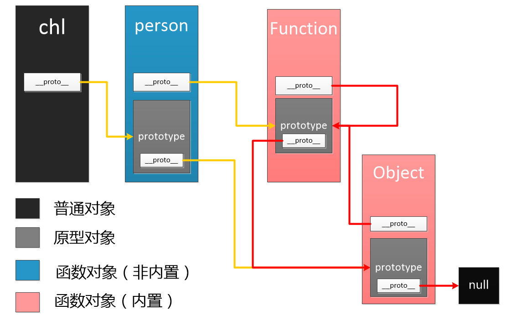

**原型**

1. 函数对象(非箭头函数)才有 prototype 属性，是显式原型，是定义时自动添加的
2. 每个对象都具有的属性 \_\_proto\_\_，是隐式原型，是创建对象时自动添加的，默认值为其构造函数的 prototype
3. Object 是所有对象的父类，他的原型的\_\_proto\_\_属性指向 null
4. 每次调用构造函数创建一个新实例对象，\_\_proto\_\_指针就会被赋值为构造函数的原型对象
5. 所有 Function 的实例都是函数对象，而其他的都是普通对象
6. 每个构造函数都有一个原型对象（实例的原型），原型有一个 constructor 属性指回构造函数，而实例有一个内部指针指向原型

```js
// 实际代码
function fn1() {}

// JavaScript 自动执行
fn1.protptype = {
  constructor: fn1,
  __proto__: Object.prototype,
}

fn1.__proto__ = Function.prototype
```

- 当试图访问一个对象的属性的时候会触发 [[Get]] 操作，即 Object.defindeProperty get，从自身即原型链上查找，直到 null
- for in、in 操作符，查找对象整条原型链

**原型链**
实例对象指向原型，假如原型是另一个类型的实例，那么原型本身则指向另一个原型，这样实例和原型之间形成了一条长长的链条，这就是原型链
原型处于原型链中时即可以是某个对象的原型也可以是另一个原型的实例，这样就能形成原型之间的继承关系




### 继承

继承的本质是一种委托机制，对象可以将需要的属性和方法委托给原型，需要用的时候就去原型上拿，这样多个对象就可以共享一个原型上的属性和方法

**一、原型链继承**
利用原型链特征实现，让构造函数的 prototype 指向另一个构造函数的实例
缺点：

1. 创建实例时不能传参，构造函数本身不接受参数。
2. 原型上的属性是引用数据类型时，所有实例都会共享这个属性，即某个实例对这个属性重写会影响其他实例

```js
function Pen() {}
function Son() {}
Son.prototype = new Pen()
```

**二、构造函数继承**
在子类中通过 call 调用父类构造函数实现上下文的绑定，但是没有继承父类原型上的方法
缺点：

1. 必须在构造函数中定义方法，构造函数继承的方法本质上都变成了实例自己的方法，不是公共的方法，因此失去了复用性。
2. 子类不能访问父类原型上定义的方法

```js
function Son() {
  Pen.call(this)
}
```

**三、组合继承**
组合继承综合了原型链继承和构造函数继承两者的优点，得到一种可以将方法定义在原型上以实现重用又可以让每个实例拥有自己的属性的继承方案
缺点：

1. 父类的构造函数被调用了两次

```js
function Pen() {}
function Son() {
  Pen.call(this)
}
Son.prototype = new Pen()
```

**四、原型式继承**
将原型链继承的核心代码封装成了一个函数，执行完后构造函数就随着函数作用域一起被回收了
类似 Object.create，通过第二个参数新增的属性是直接挂载到新建对象本身，而不是挂载在它的原型上
缺点：

1. 不能传参
2. 原对象中的引用类型的属性会被新对象共享

```js
const object = function (o) {
  function F() {}
  F.prototype = o
  return new F()
}
```

**五、寄生式继承**
在原型式继承的基础上以某种方式增强对象，然后返回这个对象

```js
function inherit(o) {
  let clone = Object.create(o)
  clone.sayHi = function () {
    // 增强对象
    console.log('Hi')
  }
  return clone
}
```

**六、寄生式组合继承**
使用寄生式继承来继承父类的原型对象，然后将返回的新对象赋值给子类的原型对象

```js
function inherit(Son, Father) {
  const prototype = Object.create(Father.prototype) // 获取父类原型对象副本
  prototype.constructor = Son // 将获取的副本的constructor指向子类，以此增强副本原型对象
  Son.prototype = prototype // 将子类的原型对象指向副本原型对象
}

function Pen(eyes) {}
function Son() {
  Pen.call(this)
}
inherit(Son, Pen) // 寄生式继承，不用第二次调用构造函数
```
